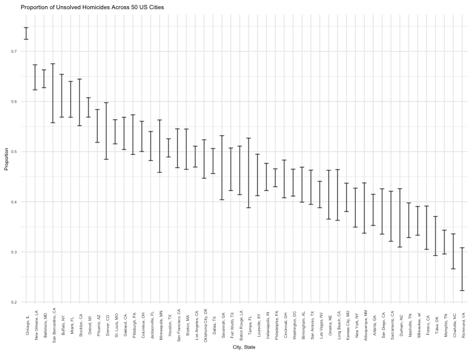
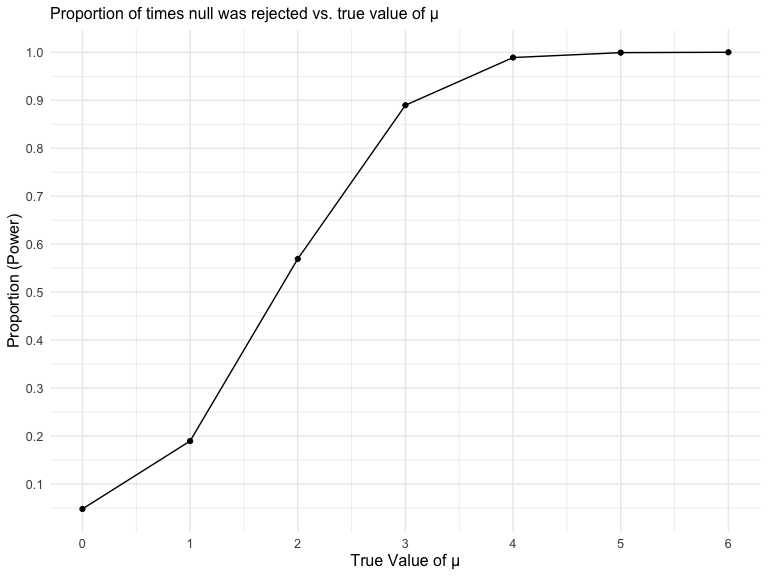
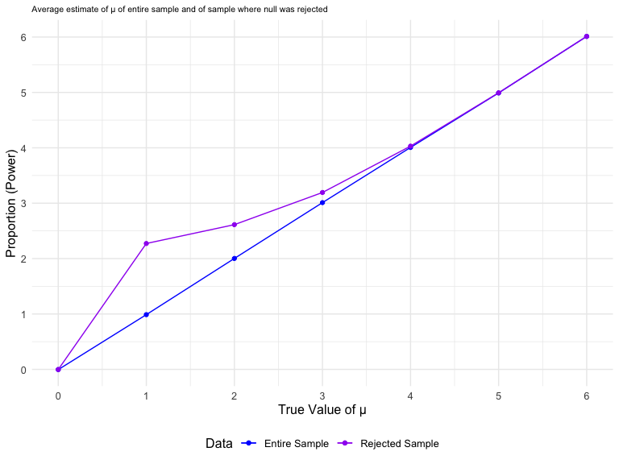

HW5
================

### Load packages

``` r
library(tidyverse)
library(rvest)

knitr::opts_chunk$set(
    echo = TRUE,
    warning = FALSE,
    fig.width = 8, 
  fig.height = 6,
  out.width = "90%"
)

theme_set(theme_minimal() + theme(legend.position = "bottom"))

options(
  ggplot2.continuous.colour = "viridis",
  ggplot2.continuous.fill = "viridis"
)

scale_colour_discrete = scale_colour_viridis_d
scale_fill_discrete = scale_fill_viridis_d
```

## Question 1

Import data by listing out all path names and using `map` to grab
observations for each path.

``` r
df <-
  tibble(
    files = list.files("data"),
    path = str_c("data/", files)
  ) %>%
  mutate(data = map(path, read_csv)) %>%
  unnest()
```

Clean data

``` r
tidydf <- 
  df %>% 
  mutate(
    files = str_replace(files, ".csv", ""),
    group = str_sub(files, 1, 3)) %>% 
  pivot_longer(
    week_1:week_8,
    names_to = "week",
    values_to = "outcome",
    names_prefix = "week_") %>% 
  mutate(week = as.numeric(week)) %>% 
  select(group, subject = files, week, outcome)
```

Plot data showing observations of each subject over time

``` r
tidydf %>%
  ggplot(aes(x = week, y = outcome, color = group, group = subject)) +
  geom_point() +
  geom_path() + 
  facet_grid(~group)
```


The graph suggests that outcomes are highly correlated within each
group - the outcome of those in the experimental arm are more likely to
trend upward over time while the outcome of those in the control arm
vary over time.

## Question 2

Import homicide data from Washington Post github

``` r
post <- read_csv("https://raw.github.com/washingtonpost/data-homicides/master/homicide-data.csv") %>%
  janitor::clean_names() %>%
  mutate(
    state = case_when(
      city %in% "Tulsa" ~ "OK",
      TRUE ~ state
    ),
    city_state = paste(city, state, sep =  ", ")) %>%
  select(city_state, everything())
```

    ## Rows: 52179 Columns: 12
    ## ── Column specification ────────────────────────────────────────────────────────
    ## Delimiter: ","
    ## chr (9): uid, victim_last, victim_first, victim_race, victim_age, victim_sex...
    ## dbl (3): reported_date, lat, lon
    ## 
    ## ℹ Use `spec()` to retrieve the full column specification for this data.
    ## ℹ Specify the column types or set `show_col_types = FALSE` to quiet this message.

There are 52179 observations and 13 variables in the `post` dataset.
Each row is a single reported homicide by reported date, victim’s name,
race, and age, reported city and state, latitude and longitude of
report, and status of the case.

A total of 52179 cases across 28 states in 50 cities are found in the
dataset.

Create functions calculating number of total homicides, number of
unsolved homicides, and number of solved homicides for each city. `Map`
function into data nested by city.

``` r
num_hom <- function(df){
  df %>%
    group_by(city) %>%
    summarize(n_homicide = n()) %>%
    select(-city)
}

num_unsolved <- function(df){
  df %>%
    filter(disposition == "Closed without arrest" | disposition == "Open/No arrest") %>%
    group_by(city) %>%
    summarize(n_unsolved = n()) %>%
    select(-city)
}

num_solved <- function(df){
  df %>%
    filter(disposition == "Closed by arrest") %>%
    group_by(city) %>%
    summarize(n_solved = n()) %>%
    select(-city)
}

post_nest <-
  post %>%
  nest(data = uid:disposition) %>%
  mutate(n_homicide = map(data, num_hom),
         n_unsolved = map(data, num_unsolved),
         n_solved = map(data, num_solved)) %>%
  unnest(c(n_homicide, n_unsolved, n_solved))
```

Use `map2` to estimate proportion of unsolved homicides in Baltimore, MD
and pull out estimate and 95% CI into a tibble.

``` r
balti_hom <- 
  post_nest %>%
  filter(city_state == "Baltimore, MD") %>%
  mutate(prop_test = map2(n_unsolved, n_homicide, ~prop.test(.x,.y, conf.level = 0.95) %>%
                            broom::tidy())) %>% 
  unnest(prop_test) %>%
  select(city_state, estimate, "CI_lower" = conf.low, "CI_upper" = conf.high)

balti_hom
```

    ## # A tibble: 1 × 4
    ##   city_state    estimate CI_lower CI_upper
    ##   <chr>            <dbl>    <dbl>    <dbl>
    ## 1 Baltimore, MD    0.646    0.628    0.663

Use `map2` to estimate proportion of unsolved homicides in all cities
and pull estimate and 95% CI into a tibble.

``` r
all_hom <-
  post_nest %>%
  mutate(prop_test = map2(n_unsolved, n_homicide, ~prop.test(.x,.y, conf.level = 0.95) %>%
                            broom::tidy())) %>% 
  unnest(prop_test) %>%
  select(city_state, estimate, "ci_lower" = conf.low, "ci_upper" = conf.high)

all_hom
```

    ## # A tibble: 50 × 4
    ##    city_state      estimate ci_lower ci_upper
    ##    <chr>              <dbl>    <dbl>    <dbl>
    ##  1 Albuquerque, NM    0.386    0.337    0.438
    ##  2 Atlanta, GA        0.383    0.353    0.415
    ##  3 Baltimore, MD      0.646    0.628    0.663
    ##  4 Baton Rouge, LA    0.462    0.414    0.511
    ##  5 Birmingham, AL     0.434    0.399    0.469
    ##  6 Boston, MA         0.505    0.465    0.545
    ##  7 Buffalo, NY        0.612    0.569    0.654
    ##  8 Charlotte, NC      0.300    0.266    0.336
    ##  9 Chicago, IL        0.736    0.724    0.747
    ## 10 Cincinnati, OH     0.445    0.408    0.483
    ## # … with 40 more rows

Create plot showing proportion and 95% CI of unsolved homicides for each
city

``` r
all_hom %>%
  ggplot(aes(x = reorder(city_state, -estimate), y = estimate)) +
  geom_point(aes(color = city_state)) +
  geom_errorbar(aes(ymin = ci_lower, ymax = ci_upper), width = 0.5, alpha = 0.7) +
  labs(
    title = "Proportion of Unsolved Homicides Across 50 US Cities",
    x = "City, State",
    y = "Proportion Estimate"
  ) +
  theme(text = element_text (size = 6),
        axis.text.x = element_text(angle = 90),
        legend.position = "none")
```



## Problem 3

When designing an experiment or analysis, a common question is whether
it is likely that a true effect will be detected – put differently,
whether a false null hypothesis will be rejected. The probability that a
false null hypothesis is rejected is referred to as power, and it
depends on several factors, including: the sample size; the effect size;
and the error variance. In this problem, you will conduct a simulation
to explore power in a one-sample t-test.

First set the following design elements: Fix n=30, Fix σ=5

Set μ=0. Generate 5000 datasets from the model: x∼Normal\[μ,σ\]

For each dataset, save μ^ and the p-value arising from a test of H:μ=0
using α=0.05. Hint: to obtain the estimate and p-value, use broom::tidy
to clean the output of t.test.

``` r
sim_norm_sample <- function(mu, n = 30, sigma = 5) {
  data = tibble(
    norm_sample = rnorm(n = n, mean = mu, sd = sigma),
  )
  
  data <- t.test(data) %>%
    broom::tidy() %>%
    select(estimate, p.value)
}

sim_mu_0 <- 
  expand_grid(
    mu = 0,
    iteration = 1:5000
  ) %>% 
  mutate(
    mu_est = map(mu, sim_norm_sample)
  ) %>%
  unnest(mu_est)

sim_mu_0
```

    ## # A tibble: 5,000 × 4
    ##       mu iteration estimate p.value
    ##    <dbl>     <int>    <dbl>   <dbl>
    ##  1     0         1   -1.36   0.0913
    ##  2     0         2    2.19   0.0343
    ##  3     0         3    0.922  0.193 
    ##  4     0         4   -1.37   0.153 
    ##  5     0         5   -1.01   0.220 
    ##  6     0         6   -1.14   0.154 
    ##  7     0         7   -0.325  0.745 
    ##  8     0         8    0.893  0.342 
    ##  9     0         9   -0.944  0.297 
    ## 10     0        10    0.238  0.793 
    ## # … with 4,990 more rows

Esimates and p-values from simulated estimates located in `sim_mu_0`
with a total of 5000 observations.

Repeat the above for μ={1,2,3,4,5,6}, and complete the following:

``` r
sim_mu_1 <- 
  expand_grid(
    mu = 1:6,
    iteration = 1:5000
  ) %>% 
  mutate(
    mu_est = map(mu, sim_norm_sample)
  ) %>%
  unnest(mu_est)

sim_mu_1
```

    ## # A tibble: 30,000 × 4
    ##       mu iteration estimate p.value
    ##    <int>     <int>    <dbl>   <dbl>
    ##  1     1         1    1.15  0.143  
    ##  2     1         2    0.198 0.797  
    ##  3     1         3    0.430 0.677  
    ##  4     1         4    1.13  0.260  
    ##  5     1         5    2.99  0.00711
    ##  6     1         6    0.482 0.632  
    ##  7     1         7    2.03  0.0743 
    ##  8     1         8    1.52  0.136  
    ##  9     1         9    1.08  0.234  
    ## 10     1        10    1.17  0.209  
    ## # … with 29,990 more rows

Make a plot showing the proportion of times the null was rejected (the
power of the test) on the y axis and the true value of μ on the x axis.
Describe the association between effect size and power.

``` r
sim_mu <- rbind(sim_mu_0, sim_mu_1)

sim_mu %>%
  group_by(mu) %>%
  summarize(prop_reject = sum(p.value < 0.05)/n()) %>%
  ggplot(aes(x = mu, y = prop_reject)) +
  geom_point() +
  geom_line() +
  labs(
    title = "Proportion of times null was rejected vs. true value of μ",
    x = "True Value of μ",
    y = "Proportion (Power)"
  ) +
  theme(plot.title = element_text(size = 12),
        text = element_text(size = 12),
        legend.position = "none") +
  scale_x_continuous(breaks = seq(0, 6, by = 1)) +
  scale_y_continuous(breaks = seq(0, 1, by = 0.1))
```


Based on the graph, we see a positive relationship between effect size
and power. Between mu = 0 and mu = 3, power increases but after mu = 3
(or as power approaches 1), the slope of the curve tapers off,
suggesting a decreasing effect of effect size on power.

Make a plot showing the average estimate of μ̂ on the y axis and the true
value of μ on the x axis. Make a second plot (or overlay on the first)
the average estimate of μ̂ only in samples for which the null was
rejected on the y axis and the true value of μ on the x axis. Is the
sample average of μ̂ across tests for which the null is rejected
approximately equal to the true value of μ? Why or why not?

``` r
mean_est <- sim_mu %>%
  group_by(mu) %>%
  summarize(mean_est = mean(estimate))

mean_est_rej <- sim_mu %>%
  filter(p.value < 0.05) %>%
  group_by(mu) %>%
  summarize(mean_est = mean(estimate))

ggplot(mean_est, aes(x = mu, y = mean_est, color = "Entire Sample")) +
  geom_point() +
  geom_line() +
  geom_point(data = mean_est_rej, aes(x = mu, y = mean_est, color = "Rejected Sample")) +
  geom_line(data = mean_est_rej, aes(x = mu, y = mean_est, color = "Rejected Sample")) +
  labs(
    title = "Average estimate of μ of entire sample and of sample where null was rejected",
    x = "True Value of μ",
    y = "Proportion (Power)"
  ) +
  scale_color_manual(name = "Data",
                     breaks = c("Entire Sample", "Rejected Sample"),
                     values = c("Entire Sample" = "blue", "Rejected Sample" = "purple")) +
  theme(plot.title = element_text(size = 8),
        text = element_text(size = 12)) +
  scale_x_continuous(breaks = seq(0, 6, by = 1)) +
  scale_y_continuous(breaks = seq(0, 6, by = 1))
```


Based on the graph, we see the average estimates of mu hat in samples
where the null was rejected differs with the average estimate of mu hat
among all samples between mu = 0 and mu = 4. A possible reason for the
divergence is because of the relationship between effect size and power.
As we see in the previous graph, power at mu = 1 is \~0.2 and \~0.55 at
mu = 2. This suggests that at ‘lower’ effect sizes, samples are not
correctly rejected due to low power, thus the deviation from the average
true mu.
