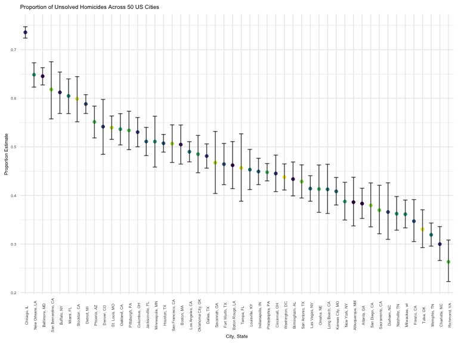

HW5
================

### Load packages

``` r
library(tidyverse)
library(rvest)

knitr::opts_chunk$set(
    echo = TRUE,
    warning = FALSE,
    fig.width = 8, 
  fig.height = 6,
  out.width = "90%"
)

theme_set(theme_minimal() + theme(legend.position = "bottom"))

options(
  ggplot2.continuous.colour = "viridis",
  ggplot2.continuous.fill = "viridis"
)

scale_colour_discrete = scale_colour_viridis_d
scale_fill_discrete = scale_fill_viridis_d
```

## Question 1

Import data by listing out all path names and using `map` to grab
observations for each path.

``` r
df <-
  tibble(
    files = list.files("data"),
    path = str_c("data/", files)
  ) %>%
  mutate(data = map(path, read_csv)) %>%
  unnest()
```

Clean data

``` r
tidydf <- 
  df %>% 
  mutate(
    files = str_replace(files, ".csv", ""),
    group = str_sub(files, 1, 3)) %>% 
  pivot_longer(
    week_1:week_8,
    names_to = "week",
    values_to = "outcome",
    names_prefix = "week_") %>% 
  mutate(week = as.numeric(week)) %>% 
  select(group, subject = files, week, outcome)
```

Plot data showing observations of each subject over time

``` r
tidydf %>%
  ggplot(aes(x = week, y = outcome, color = group, group = subject)) +
  geom_point() +
  geom_path() + 
  facet_grid(~group)
```


The graph suggests that outcomes are highly correlated within each
group - the outcome of those in the experimental arm are more likely to
trend upward over time while the outcome of those in the control arm
vary over time.

## Question 2

Import homicide data from Washington Post github

``` r
post <- read_csv("https://raw.github.com/washingtonpost/data-homicides/master/homicide-data.csv") %>%
  janitor::clean_names() %>%
  mutate(
    state = case_when(
      city %in% "Tulsa" ~ "OK",
      TRUE ~ state
    ),
    city_state = paste(city, state, sep =  ", ")) %>%
  select(city_state, everything())
```

    ## Rows: 52179 Columns: 12
    ## ── Column specification ────────────────────────────────────────────────────────
    ## Delimiter: ","
    ## chr (9): uid, victim_last, victim_first, victim_race, victim_age, victim_sex...
    ## dbl (3): reported_date, lat, lon
    ## 
    ## ℹ Use `spec()` to retrieve the full column specification for this data.
    ## ℹ Specify the column types or set `show_col_types = FALSE` to quiet this message.

There are 52179 observations and 13 variables in the `post` dataset.
Each row is a single reported homicide by reported date, victim’s name,
race, and age, reported city and state, latitude and longitude of
report, and status of the case.

A total of 52179 cases across 28 states in 50 cities are found in the
dataset.

Create functions calculating number of total homicides, number of
unsolved homicides, and number of solved homicides for each city. `Map`
function into data nested by city.

``` r
num_hom <- function(df){
  df %>%
    group_by(city) %>%
    summarize(n_homicide = n()) %>%
    select(-city)
}

num_unsolved <- function(df){
  df %>%
    filter(disposition == "Closed without arrest" | disposition == "Open/No arrest") %>%
    group_by(city) %>%
    summarize(n_unsolved = n()) %>%
    select(-city)
}

num_solved <- function(df){
  df %>%
    filter(disposition == "Closed by arrest") %>%
    group_by(city) %>%
    summarize(n_solved = n()) %>%
    select(-city)
}

post_nest <-
  post %>%
  nest(data = uid:disposition) %>%
  mutate(n_homicide = map(data, num_hom),
         n_unsolved = map(data, num_unsolved),
         n_solved = map(data, num_solved)) %>%
  unnest(c(n_homicide, n_unsolved, n_solved))
```

Use `map2` to estimate proportion of unsolved homicides in Baltimore, MD
and pull out estimate and 95% CI into a tibble.

``` r
balti_hom <- 
  post_nest %>%
  filter(city_state == "Baltimore, MD") %>%
  mutate(prop_test = map2(n_unsolved, n_homicide, ~prop.test(.x,.y, conf.level = 0.95) %>%
                            broom::tidy())) %>% 
  unnest(prop_test) %>%
  select(city_state, estimate, "CI_lower" = conf.low, "CI_upper" = conf.high) %>%
  knitr::kable(digits = 2)

balti_hom
```

| city_state    | estimate | CI_lower | CI_upper |
|:--------------|---------:|---------:|---------:|
| Baltimore, MD |     0.65 |     0.63 |     0.66 |

Use `map2` to estimate proportion of unsolved homicides in all cities
and pull estimate and 95% CI into a tibble.

``` r
all_hom <-
  post_nest %>%
  mutate(prop_test = map2(n_unsolved, n_homicide, ~prop.test(.x,.y, conf.level = 0.95) %>%
                            broom::tidy())) %>% 
  unnest(prop_test) %>%
  select(city_state, estimate, "ci_lower" = conf.low, "ci_upper" = conf.high)

all_hom
```

    ## # A tibble: 50 × 4
    ##    city_state      estimate ci_lower ci_upper
    ##    <chr>              <dbl>    <dbl>    <dbl>
    ##  1 Albuquerque, NM    0.386    0.337    0.438
    ##  2 Atlanta, GA        0.383    0.353    0.415
    ##  3 Baltimore, MD      0.646    0.628    0.663
    ##  4 Baton Rouge, LA    0.462    0.414    0.511
    ##  5 Birmingham, AL     0.434    0.399    0.469
    ##  6 Boston, MA         0.505    0.465    0.545
    ##  7 Buffalo, NY        0.612    0.569    0.654
    ##  8 Charlotte, NC      0.300    0.266    0.336
    ##  9 Chicago, IL        0.736    0.724    0.747
    ## 10 Cincinnati, OH     0.445    0.408    0.483
    ## # … with 40 more rows

Create plot showing proportion and 95% CI of unsolved homicides for each
city

``` r
all_hom %>%
  ggplot(aes(x = reorder(city_state, -estimate), y = estimate)) +
  geom_errorbar(aes(ymin = ci_lower, ymax = ci_upper), width = 0.5, alpha = 0.7) +
  labs(
    title = "Proportion of Unsolved Homicides Across 50 US Cities",
    x = "City, State",
    y = "Proportion"
  ) +
  theme(text = element_text (size = 6),
        axis.text.x = element_text(angle = 90))
```


